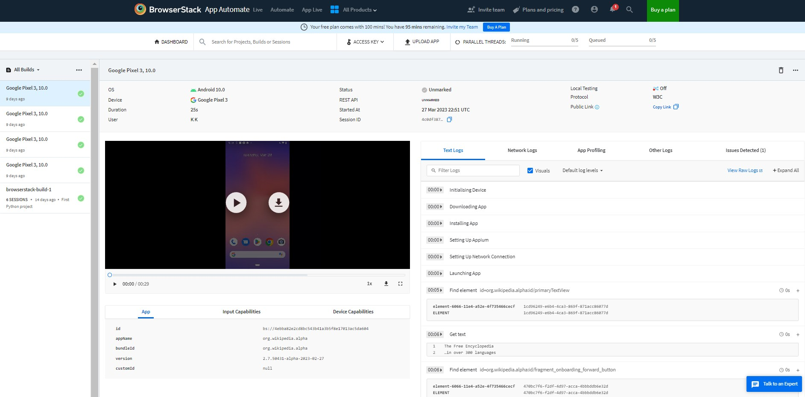

## Проект mobile автотестов для приложения Wikipedia

<!-- Технологии -->

### Технологии
<p  align="center">
  <code></code>
  <code></code>
  <code></code>
  <code></code>
  <code></code>
  <code></code>
  <code></code>
  <code></code>

</p>

### Что проверяется в проекте:
Навигацию по экранам приложения Wikipedia 
- [x] Проверка отображения стартового экрана
- [x] Проверка отображения второго экрана
- [x] Проверка отображения третьего экрана
- [x] Проверка отображения четвертого экрана

### :computer: Запуск тестов из терминала
```bash
env -S "context=browserstack" pytest .
env -S "context=emulation" pytest .
```

<!-- Browserstack -->

###  Запуск тестов в Browserstack
#### В Browserstack можем следить за прохождением тестов в реальном времени, а так же смотреть логи.



<!-- Android Studio -->
###  Запуск тестов в Browserstack + эмулятор Android
